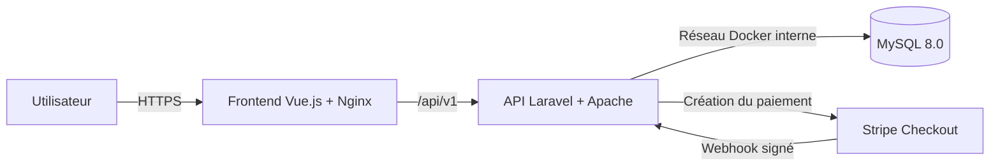

# ServiceConnect

J’ai développé ServiceConnect dans le cadre de mon travail de fin d’études. L’application met en relation des personnes qui recherchent un service avec des prestataires disponibles dans leur région.

La démonstration est accessible à cette adresse : [https://serviceconnect.jobsacademie.tech](https://serviceconnect.jobsacademie.tech)

Les utilisateurs, les annonces et les transactions présents dans l’application sont fictifs. Le paiement Stripe fonctionne en mode test et les e-mails sont enregistrés dans les logs Laravel.

## Fonctionnalités

### Visiteur

- consulter les catégories, les annonces et les profils publics ;
- rechercher un service par catégorie, localisation ou budget ;
- créer un compte et se connecter.

### Membre

- gérer son profil et ses favoris ;
- réserver un créneau auprès d’un prestataire ;
- accepter ou refuser une proposition de créneau alternatif ;
- envoyer des messages et consulter ses notifications ;
- payer une réservation acceptée avec Stripe Checkout ;
- consulter ses paiements et publier un avis.

### Prestataire

- accéder aussi au parcours membre ;
- créer et gérer ses annonces ;
- définir ses disponibilités ;
- accepter, refuser ou modifier une demande de réservation ;
- suivre ses messages, ses avis et les paiements reçus ;
- proposer une nouvelle catégorie de service.

### Administrateur

- consulter les indicateurs généraux ;
- gérer les utilisateurs, les annonces, les catégories, les avis et les paiements ;
- traiter les demandes pour devenir prestataire ;
- traiter les demandes de nouvelles catégories ;
- consulter les messages envoyés au support.

## Démonstration

Les accès aux comptes de démonstration et les informations nécessaires au test du paiement sont communiqués séparément au jury.

## Technologies

| Partie | Technologies |
| --- | --- |
| Frontend | Vue.js 3, Vite 8, Pinia, Vue Router et Nginx |
| Backend | Laravel 12, PHP 8.4, Apache et Sanctum |
| Base de données | MySQL 8.0 |
| Paiement | Stripe Checkout en mode test |
| Déploiement | Docker Compose et Portainer |
| Intégration continue | GitHub Actions et GitHub Container Registry |

## Architecture



Nginx sert l’application Vue et transmet les appels `/api`, `/storage` et `/up` au backend. MySQL reste sur un réseau Docker interne et n’expose aucun port publiquement.

## Organisation du dépôt

```text
app/                         logique de l’API Laravel
config/                      configuration Laravel
database/migrations/         structure et évolution de la base
database/seeders/            données de référence et données locales
docker/backend/              scripts de démarrage du backend
docker/nginx/                configuration Nginx
frontend/                    application Vue.js
.github/workflows/           pipeline GitHub Actions
Dockerfile.backend           image Laravel et Apache
Dockerfile.frontend          build Vue et image Nginx
docker-compose.production.yml stack utilisée dans Portainer
serviceconnect_dump.sql      données fictives de démonstration
```

## Lancement en local

Prérequis : PHP 8.4, Composer 2, Node.js 24, npm et MySQL 8.0.

### Backend

```bash
composer install
cp .env.example .env
php artisan key:generate
```

Pour travailler sans Docker, j’utilise notamment ces valeurs dans `.env` :

```dotenv
APP_ENV=local
APP_DEBUG=true
APP_URL=http://127.0.0.1:8000
FRONTEND_URL=http://localhost:5173
DB_HOST=127.0.0.1
DB_DATABASE=serviceconnect
DB_USERNAME=root
DB_PASSWORD=mot_de_passe_local
```

Je peux ensuite créer un schéma vide avec les migrations :

```bash
php artisan migrate
php artisan db:seed --class=Database\\Seeders\\ProductionSeeder
php artisan serve
```

Pour retrouver toutes les données fictives de la démonstration, j’importe d’abord `serviceconnect_dump.sql`, puis j’exécute les migrations restantes.

### Frontend

```bash
cd frontend
npm ci
npm run dev
```

En mode développement, Vite transmet `/api` et `/storage` vers Laravel sur `127.0.0.1:8000`.

## Vérifications

```bash
composer validate --strict
php artisan test

cd frontend
npm ci
npm run build
```

Ces vérifications sont également exécutées par GitHub Actions à chaque push sur `main`.

## Déploiement

La version déployée utilise quatre services Docker : MySQL, un conteneur d’initialisation, le backend et le frontend. Le frontend est publié sur le port `8201` et le backend sur le port `8200`.

Après les tests, GitHub Actions construit les deux images et les publie dans GHCR. La mise à jour de la stack reste manuelle dans Portainer. Les données MySQL et les fichiers publics sont conservés dans des volumes Docker nommés.

La procédure complète se trouve dans [DEPLOYMENT.md](DEPLOYMENT.md).

## Choix liés au TFE

- Stripe reste en mode test ;
- les e-mails utilisent `MAIL_MAILER=log` ;
- toutes les données sont fictives ;
- la mise à jour de la production reste manuelle dans Portainer.
